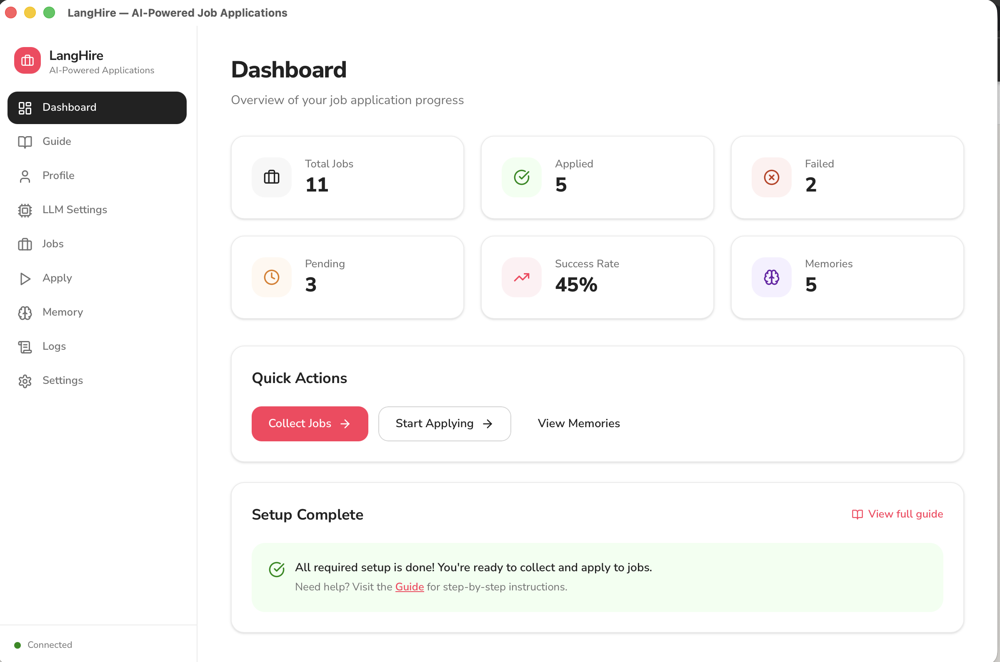
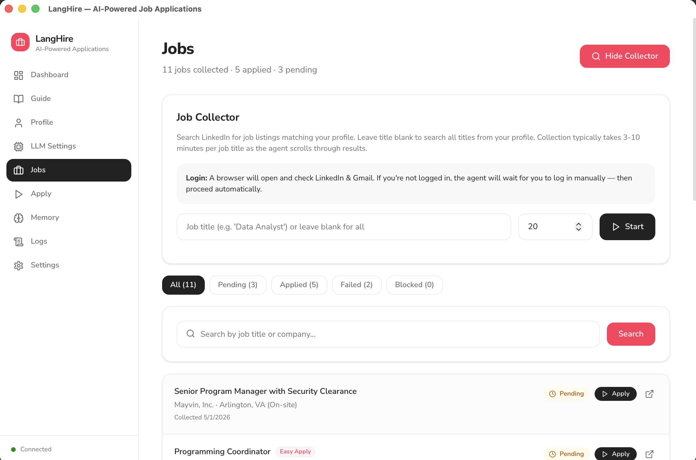
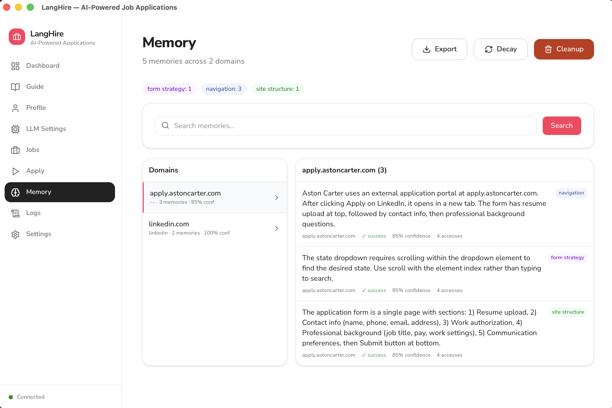

<p align="center">
  
</p>

<h1 align="center">LangHire</h1>

<p align="center">
  <strong>AI-powered job application automation with a native desktop UI</strong>
</p>

<p align="center">
  <a href="https://langhire.org"></a>
  
  
  
  
  <a href="LICENSE"></a>
</p>

---

Applying to jobs is tedious. You find a listing, click through to the application, fill in the same fields you filled in yesterday, answer the same screening questions, upload your resume again — repeat fifty times. LangHire automates the entire loop.

It uses AI browser agents to search LinkedIn, collect matching jobs, fill out applications, upload your resume, and submit — while a **self-learning memory system** remembers how each applicant tracking system (ATS) works so it gets faster and more accurate over time. Everything runs locally on your machine. No data leaves your computer except LLM API calls.

---

## Download

<div align="center">

|  macOS |  Windows |  Linux |
|:---:|:---:|:---:|
| [**Apple Silicon (.dmg)**](https://github.com/jaimaann/LangHire/releases/latest/download/LangHire_1.0.0_aarch64.dmg) | [**64-bit Installer (.exe)**](https://github.com/jaimaann/LangHire/releases/latest/download/LangHire_1.0.0_x64-setup.exe) | [**AppImage (Universal)**](https://github.com/jaimaann/LangHire/releases/latest/download/LangHire_1.0.0_amd64.AppImage) |
| [Intel (.dmg)](https://github.com/jaimaann/LangHire/releases/latest/download/LangHire_1.0.0_x64.dmg) | | [Debian / Ubuntu (.deb)](https://github.com/jaimaann/LangHire/releases/latest/download/LangHire_1.0.0_amd64.deb) |

</div>

<p align="center"><sub>Requires an LLM API key (OpenAI, Anthropic, or AWS). Chromium is installed automatically on first launch. See <a href="#quick-start">Quick Start</a>.</sub></p>

> **Developers** -- See [Development Setup](#development-setup) to run from source.

### Installation Notes

<details>
<summary><strong>macOS</strong></summary>

The macOS release is **signed and notarized** by Apple. Just open the `.dmg`, drag LangHire to Applications, and double-click to launch. No extra steps needed.
</details>

<details>
<summary><strong>Windows</strong> -- "Windows protected your PC" (SmartScreen)</summary>

The Windows installer is not code-signed. You may see a SmartScreen warning:

1. Run the `.exe` installer
2. If you see **"Windows protected your PC"**:
   - Click **More info**
   - Click **Run anyway**
3. Complete the installer and launch LangHire
</details>

<details>
<summary><strong>Linux</strong> -- AppImage or .deb</summary>

**AppImage:**
```bash
chmod +x LangHire_1.0.0_amd64.AppImage
./LangHire_1.0.0_amd64.AppImage
```

**Debian / Ubuntu:**
```bash
sudo dpkg -i LangHire_1.0.0_amd64.deb
```
</details>

---

## Features

- **Native desktop app** -- macOS, Windows, and Linux
- **Job collection** -- Searches LinkedIn for jobs matching your target titles and locations
- **Automated applications** -- AI agent fills forms, uploads your resume, answers screening questions
- **Tailored resumes** (beta) -- Auto-customizes your resume for each job description
- **Self-learning memory** -- Stores per-ATS procedural knowledge (navigation patterns, form strategies, UI quirks). Lessons from one Workday site apply to all Workday sites.
- **Smart Q&A reuse** -- Learns answers from previous applications and reuses them
- **Multi-LLM support** -- OpenAI, Anthropic, AWS Bedrock, or Ollama for local models
- **Dashboard** -- Real-time stats, success rates, per-domain performance, memory impact analysis
- **CLI tools** -- Power-user scripts for collection, application, memory management, and analytics
- **100% local** -- All data stored on your machine in your OS app data directory

---

## Screenshots

<table>
<tr>
<td align="center" width="33%">
<details>
<summary><br/><strong>Dashboard</strong></summary>

</details>
</td>
<td align="center" width="33%">
<details>
<summary><br/><strong>Jobs</strong></summary>

</details>
</td>
<td align="center" width="33%">
<details>
<summary><br/><strong>Memory</strong></summary>

</details>
</td>
</tr>
</table>

<p align="center"><sub>Click any screenshot to expand</sub></p>

---

## Quick Start

1. **Download and install** from the [Download](#download) section above
2. **Open the app** -- Chromium downloads automatically on first launch (~400 MB, one time)
3. **Setup wizard** walks you through: **LLM provider** → **Resume upload** (auto-parses your profile) → **Review profile** → Ready
4. **Collect jobs** -- go to **Jobs** → enter a job title → **Start Collecting**
5. **Apply** -- go to **Apply** → **Start Applying** and watch the dashboard as applications roll in

---

## How It Works

LangHire runs a three-stage loop: **Collect → Apply → Learn**.

**Collect** -- An AI browser agent logs into LinkedIn, searches for jobs matching your target titles and locations, and saves each listing with its URL, company, title, and description.

**Apply** -- For each pending job, the agent opens the application (Easy Apply or external ATS), fills every field using your profile, uploads your resume, answers screening questions from its Q&A bank, and submits. Multiple workers can run in parallel.

**Learn** -- After each application, the system extracts procedural learnings: which buttons to click, how forms are structured, what fails and what works. These memories are stored per-ATS domain with confidence scores, so next time it encounters the same ATS, it already knows how to navigate it.

### Architecture

```
┌──────────────────────────────────────────────────┐
│              Tauri Desktop Shell (Rust)           │
│     Lightweight native wrapper, ~10 MB           │
└────────────────────┬─────────────────────────────┘
                     │ spawns sidecar
                     ▼
┌──────────────────────────────────────────────────┐
│  React Frontend          │  FastAPI Backend      │
│  (TypeScript)            │  (Python sidecar)     │
│                          │                       │
│  - Dashboard             │  - browser-use agents │
│  - Profile editor        │  - Playwright browser │
│  - LLM settings          │  - Memory system      │
│  - Job browser           │  - Multi-LLM factory  │
│  - Apply controls        │  - 20+ REST endpoints │
│  - Memory viewer         │                       │
│          ◄── HTTP localhost:8742 ──►             │
└──────────────────────────────────────────────────┘
                     │
                     ▼
        SQLite + JSON (OS app data directory)
```

All data is stored locally:

| OS | Path |
|----|------|
| macOS | `~/Library/Application Support/langhire/` |
| Windows | `%APPDATA%/langhire/` |
| Linux | `~/.config/langhire/` |

---

## Development Setup

### Prerequisites

| Tool | Version | Install |
|------|---------|---------|
| Node.js | 18+ | [nodejs.org](https://nodejs.org) |
| Rust | 1.77+ | `curl --proto '=https' --tlsv1.2 -sSf https://sh.rustup.rs \| sh` |
| Python | 3.13+ | [python.org](https://python.org) |
| uv | latest | `curl -LsSf https://astral.sh/uv/install.sh \| sh` |

### Clone and Install

```bash
git clone https://github.com/jaimaann/LangHire.git
cd LangHire

npm install                                    # Node dependencies
uv sync                                        # Python dependencies
uv run python -m playwright install chromium   # Browser engine
```

### Run in Development

Two terminals:

```bash
# Terminal 1 -- Python backend
uv run python backend/main.py

# Terminal 2 -- Frontend dev server
npm run dev
```

Open http://localhost:1420, or run as a native desktop app instead:

```bash
# Terminal 2 (alternative) -- Native Tauri app
cargo tauri dev
```

> The first `cargo tauri dev` compiles the Rust shell (~2 min). Subsequent runs are fast.

### Build for Production

```bash
cargo tauri build
```

Produces platform-specific installers in `src-tauri/target/release/bundle/`.

---

## Project Structure

```
LangHire/
├── src/                        # React frontend (TypeScript)
│   ├── pages/                  # Dashboard, Profile, Jobs, Apply, Memory, Settings, LLMSettings, Logs
│   ├── components/             # UI primitives, SetupWizard, Sidebar, LoginCards
│   └── lib/                    # API client, TypeScript types
│
├── backend/                    # Python backend (FastAPI)
│   ├── main.py                 # Server with 20+ endpoints
│   ├── core/                   # Config, LLM factory, shared utilities
│   └── memory/                 # SQLite store, post-run extractors, metrics
│
├── src-tauri/                  # Tauri native shell (Rust)
│   ├── src/lib.rs              # App setup, sidecar launch
│   └── tauri.conf.json         # Window config, permissions, bundling
│
├── cli/                        # CLI automation scripts
│   ├── collect_jobs.py         # Job collection
│   ├── apply_jobs.py           # Job application (multi-worker)
│   ├── apply_jobs_tailored.py  # Tailored resume variant
│   ├── dashboard.py            # Terminal analytics dashboard
│   └── memory_cli.py           # Memory management
│
└── scripts/                    # Build helpers (macOS DMG, backend bundling)
```

---

## CLI Usage

The CLI scripts work standalone alongside the desktop app:

```bash
# Collect jobs from LinkedIn
uv run python cli/collect_jobs.py

# Apply to jobs (3 parallel workers)
uv run python cli/apply_jobs.py --workers 3

# Apply with per-job tailored resumes
uv run python cli/apply_jobs_tailored.py --workers 2

# Memory management
uv run python cli/memory_cli.py stats
uv run python cli/memory_cli.py domains
uv run python cli/memory_cli.py show linkedin.com

# Terminal performance dashboard
uv run python cli/dashboard.py
```

---

## Contributing

Contributions are welcome. See [CONTRIBUTING.md](CONTRIBUTING.md) for full guidelines.

```bash
git clone https://github.com/jaimaann/LangHire.git
cd LangHire
npm install && uv sync
uv run python backend/main.py   # Terminal 1
npm run dev                     # Terminal 2
```

**Areas where help is needed:**

- **More job platforms** -- Indeed, Glassdoor, and other job listing sites beyond LinkedIn
- **Local LLM support** -- Ollama, llama.cpp, and other local inference options
- **Multi-country support** -- Localized job sites, address formats, and work authorization flows
- **Documentation** -- Tutorials, video walkthroughs, and guides
- **Testing** -- Unit, integration, and E2E test coverage

---

## License

[MIT](LICENSE)

---

## Disclaimer

This tool automates job applications on LinkedIn and other platforms. Use it responsibly:

- Respect each platform's Terms of Service and rate limits
- Don't spam employers with low-quality applications
- Review your profile and settings before running automated applications
- You are responsible for all applications submitted through this tool

---

<p align="center">
  Built with <a href="https://tauri.app">Tauri</a>, <a href="https://react.dev">React</a>, <a href="https://python.org">Python</a>, and <a href="https://github.com/browser-use/browser-use">browser-use</a>
</p>
